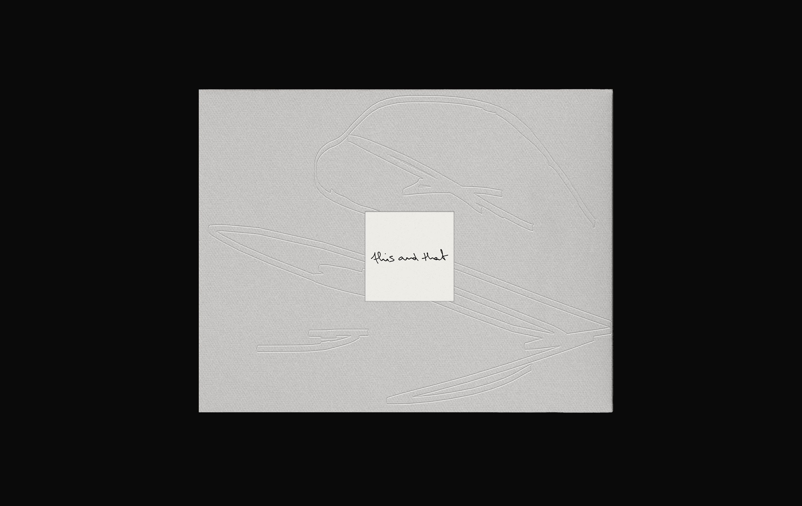
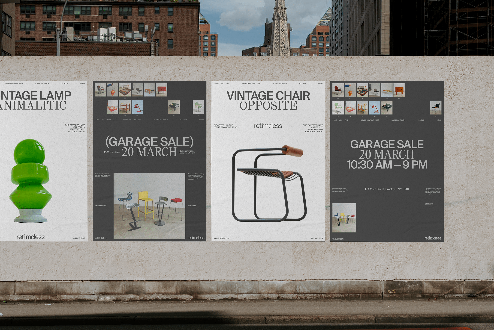
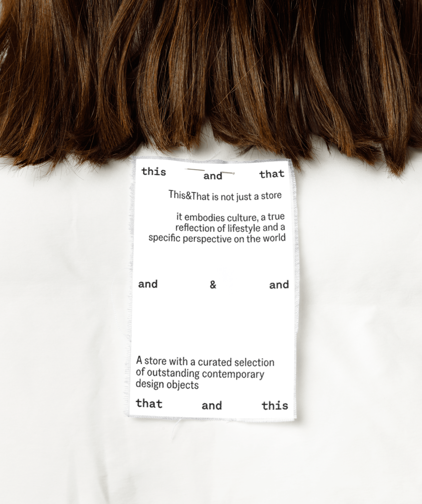

  𒊹 IDENTITY FOR THE FASHION CONCEPT STORE

 

  Brand Identity for a niche concept store with a curated selection of contemporary design objects

  VIEW PROJECT→

  𒊹 IDENTITY FOR THE FASHION BRAND «BARELYBEARABLE»

  Barely Bearable is a world-famous brand that produces many lines of clothing, capsule, without reference to seasonality

  VIEW PROJECT→

  𒊹 IDENTITY FOR A RETRO FURNITURE STORE RETIMELESS

  Identity concept for a brand that specializes in selling high-quality restored retro furniture

  VIEW PROJECT→

  𒊹 IDENTITY FOR THE CONCEPT STORE THIS&THAT

  A brand identity for the store with a curated selection of outstanding contemporary design items.

  VIEW PROJECT→

<head>
<link rel="preconnect" href="https://fonts.googleapis.com">
<link rel="preconnect" href="https://fonts.gstatic.com" crossorigin>
<link href="https://fonts.googleapis.com/css2?family=Inter:wght@440&display=swap" rel="stylesheet">
<head>
